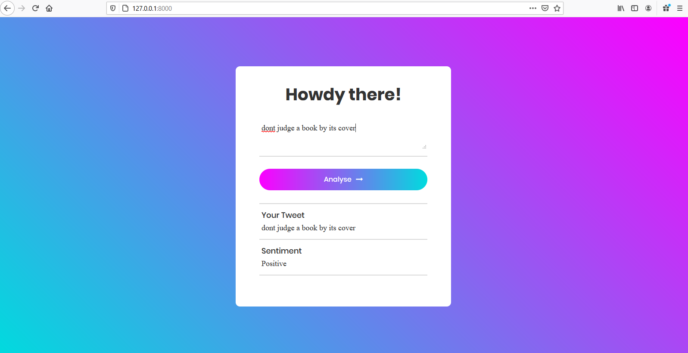
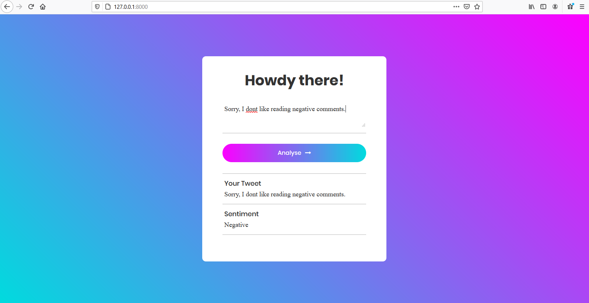
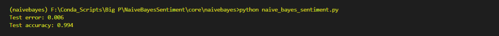
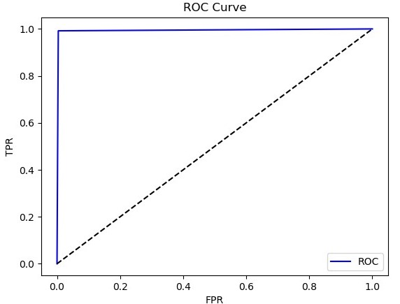

# Sentiment Analysis using Naive Bayes

[Heroku web app](https://sentysis.herokuapp.com/)

Using Naive Bayes for sentiment analysis on tweets. Given a tweet, the objective is to predict whether it has a positive sentiment or a negative sentiment.

Dataset: [nltk's twitter_samples](http://www.nltk.org/howto/twitter.html#Using-a-Tweet-Corpus)

* Train Naive Bayes model to analyse the sentiment of tweets
* Test the model's performance
* Predict on custom tweet

## Install dependencies
Use the package manager [pip](https://pip.pypa.io/en/stable/) to install all the dependencies.

```bash
pip install -r requirements.txt
```

## Demo
#### Training and Testing
```bash
cd NaiveBayesSentiment
cd core/naivebayes

python naive_bayes_sentiment.py
```
#### Prediction
[Click here](https://sentysis.herokuapp.com/)

## Deployment
* [Credits](https://coreyms.com/)
* [Tutorial](https://www.youtube.com/watch?v=6DI_7Zja8Zc)

## Built With
* [Django](https://www.djangoproject.com/) - Python based web framework that does all the heavy lifting
* [Gunicorn](https://gunicorn.org/) - Python WSGI HTTP Server
* [Heroku](https://www.heroku.com/) - Cloud application platform


## Screenshots
Positive Example


Negative Example


Test Accuracy


ROC Curve


## License
[MIT](https://choosealicense.com/licenses/mit/)